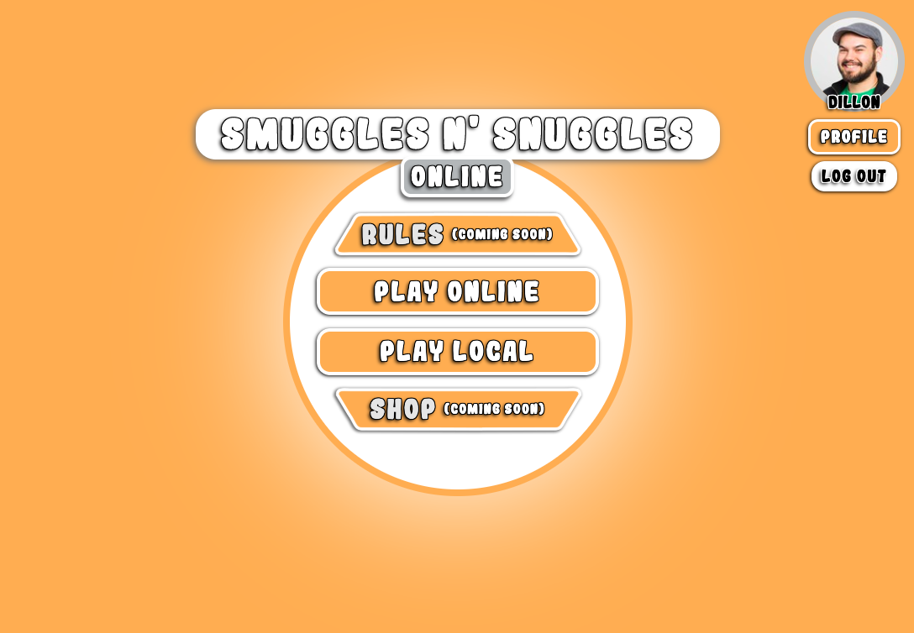
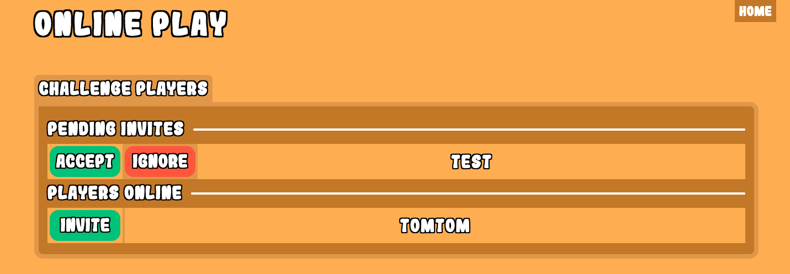
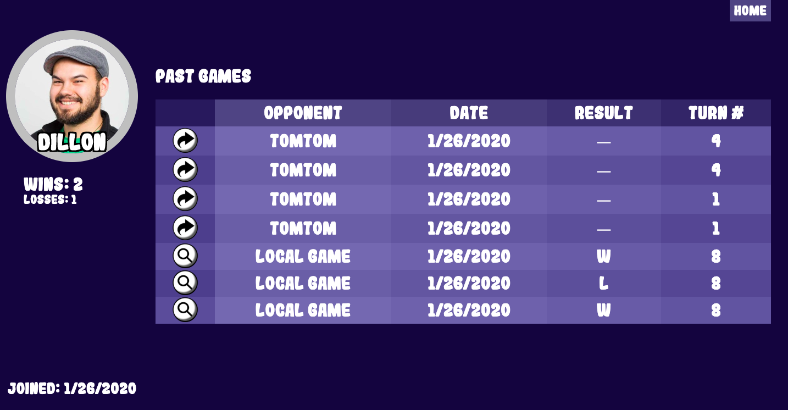
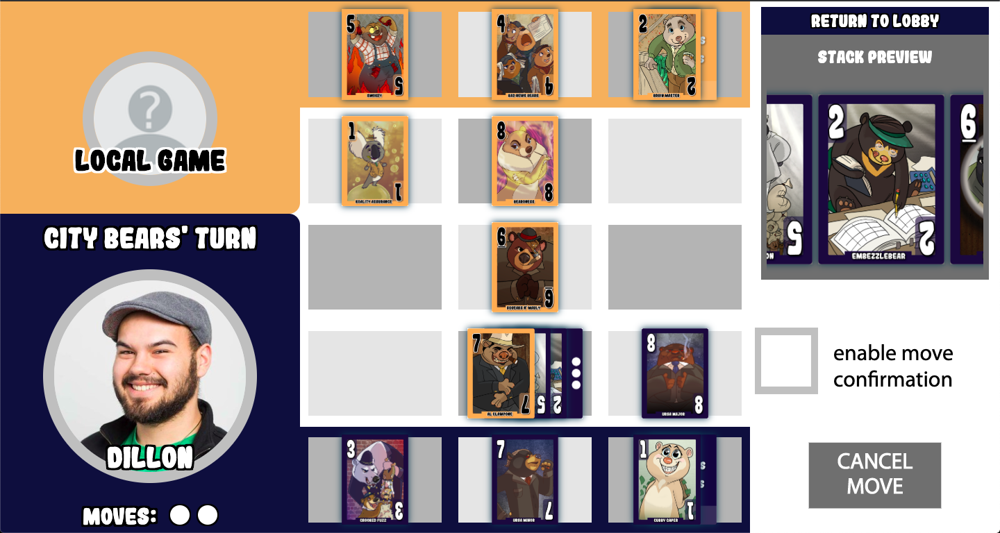
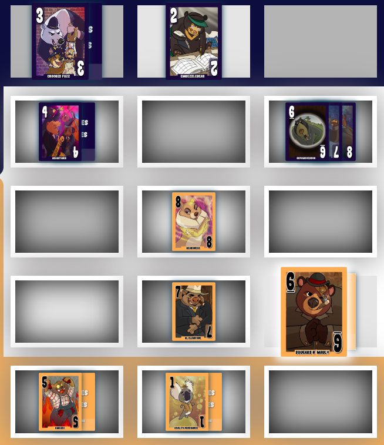
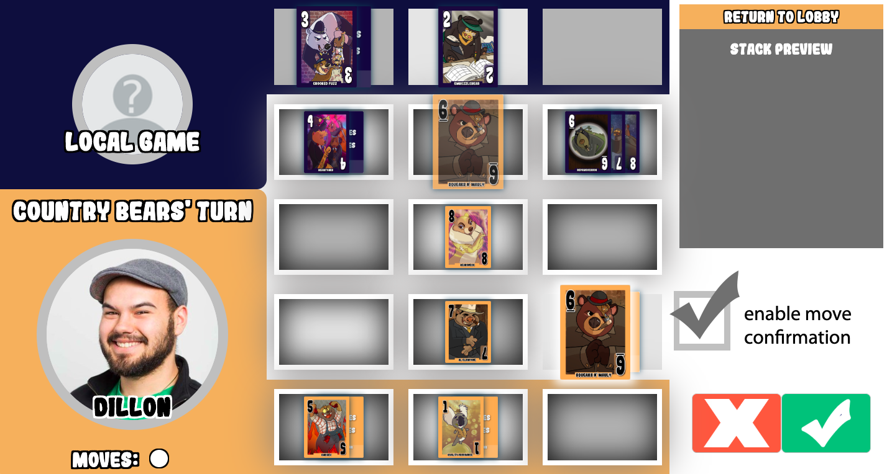
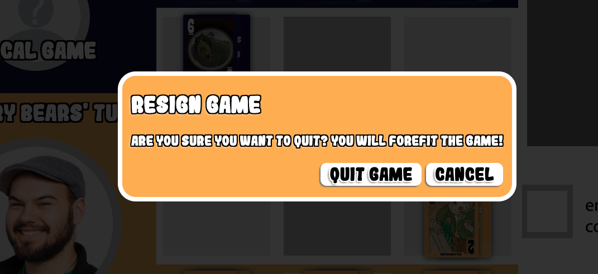

# Smuggles N' Snuggles Online

Smuggles N' Snuggles is a 2-player strategy card game created by Jonathan Ahnert. This website allows a user to play the game online, either with two players on the same computer or with anyone on the web.

In addition to the game, the visual design of the website was largely created by Jonathan Ahnert.

This website is still in development, but is in a functional beta where the core experience (the gameplay) is available.

## Game Details

The successfully funded Kickstarter for the game is [available here](https://www.kickstarter.com/projects/1157356534/smuggles-n-snuggles).

If you're looking for the rules they are available on the kickstarter or you can simply watch the kickstarter [video on the rules here](https://v.kickstarter.com/1580787417_2fb580e035c76cb424b05340c840b36bca6b6ee3/assets/021/714/196/e62702fc22cb3d2296a73a5f655cc76c_h264_high.mp4). The website is still in development and the rules will be hosted on the site as well at some point in the future.

The goal of the game is to move your cards across the 3x5 board to your opponents back line. To aid in this process you can Smuggle your smaller bears through your larger bears or capture (Snuggle) enemy bears of equal or smaller size by moving on top of them. Only the top card at any location on the board can be interacted with.

Each player moves twice per turn except for the first player's first turn where they only get to move once. The first player to move onto all three of their opponent's back line spaces wins.

## Website Details

### Stack

The website uses the following tech stack:

- Ruby on Rails with PostgreSQL
- SCSS
- React on pages with complex interaction
- HTML and Vanilla JS on minimally interactive pages
- ActionCable (websockets) for online connection
- Heroku
- Paperclip (soon to be re replaced with AWS image storage)

### Preview

A demo account has been set up for anyone who wants to demo the website without creating an account:

| Username | password |
| :---: | :---: |
| preview | password |

For those just looking to get an idea of the website here are its main features:

- Home page with easy navigation to all relevant pages on the site:

- Online lobby: 
- Profile page with your game history and the ability to return to uncompleted games (and soon to have profile picture editing functionality) 
- The meat of the website is its gamelay page.
  - The page has a turn indicator, profile pictures of the players, the game board, a preview that shows any stack of cards you click on (they can get arbitrarially deep), and a toggled option for hovering move confirmation if a player is worried about mis-clicks causing accidental moves 
  - When a card is selected it is highlighted and all available moves are marked on the board 
  - When move confirmation is active, clicking on one of the available locations for a move will render a transparent card and ask for confirmation 
- The website also features an accessible modal with custom focus handling 

### Future enhancements

The Smuggles N' Snuggles Online website is still in active development and will soon be updated with some important features:

- Accessibility is lacking in some significant areas including form validation and keyboard support for the main gameplay functionality.
- Image storage with AWS will allow prifile pictures to persist (Paperclip is now deprecated in conjunction with heroku and updating to AWS will be necessary).
- Updating profile pictures with dynamic image previewing on upload
- An emote wheel for in game communication with your opponent (Think Hearthstone style in game communication).
- Review game functionality so you can learn from your mistakes and replay any game starting from any move in that game's history

